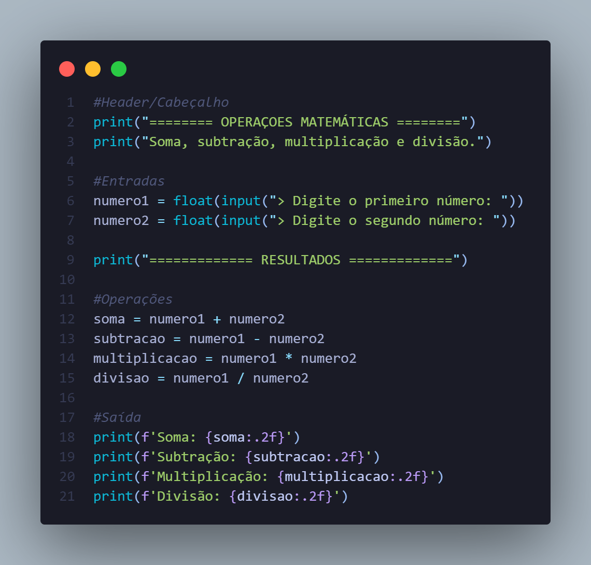

# Exercício 01 
### 🔷 Operações Matemáticas 

Crie um programa que solicite dois números inteiros ao usuário e exiba a soma, subtração, multiplicação e divisão desses números.

### ✅ Resolução 

### 📋 Aprendizados

Mesmo que eu já tivesse feito esse exercício anteriormente, adicionei **melhorias** no código: um cabeçalho para organizar melhor o resultado no terminal e um novo tipo de formatação das saídas, utilizando o *format*.

    Além disso, agora adotei a boa prática de comentar os códigos, até nos mais simples como esse.

